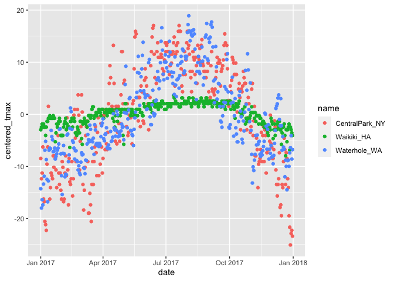

exploratory analysis
================
Kaila Boyer
10/12/2021

## Loading data

``` r
weather_df =  
  rnoaa::meteo_pull_monitors(
    c("USW00094728", "USC00519397", "USS0023B17S"),
    var = c("PRCP", "TMIN", "TMAX"), 
    date_min = "2017-01-01",
    date_max = "2017-12-31") %>%
  mutate(
    name = recode(
      id, 
      USW00094728 = "CentralPark_NY", 
      USC00519397 = "Waikiki_HA",
      USS0023B17S = "Waterhole_WA"),
    tmin = tmin / 10,
    tmax = tmax / 10,
    month = lubridate::floor_date(date, unit = "month")) %>%
  select(name, id, everything())
```

    ## Registered S3 method overwritten by 'hoardr':
    ##   method           from
    ##   print.cache_info httr

    ## using cached file: ~/Library/Caches/R/noaa_ghcnd/USW00094728.dly

    ## date created (size, mb): 2021-03-22 17:09:07 (7.559)

    ## file min/max dates: 1869-01-01 / 2021-03-31

    ## using cached file: ~/Library/Caches/R/noaa_ghcnd/USC00519397.dly

    ## date created (size, mb): 2021-10-05 10:30:50 (1.697)

    ## file min/max dates: 1965-01-01 / 2020-02-29

    ## using cached file: ~/Library/Caches/R/noaa_ghcnd/USS0023B17S.dly

    ## date created (size, mb): 2021-10-05 10:30:53 (0.912)

    ## file min/max dates: 1999-09-01 / 2021-09-30

## group\_by

``` r
weather_df %>% 
  group_by(month, name) 
```

    ## # A tibble: 1,095 × 7
    ## # Groups:   month, name [36]
    ##    name           id          date        prcp  tmax  tmin month     
    ##    <chr>          <chr>       <date>     <dbl> <dbl> <dbl> <date>    
    ##  1 CentralPark_NY USW00094728 2017-01-01     0   8.9   4.4 2017-01-01
    ##  2 CentralPark_NY USW00094728 2017-01-02    53   5     2.8 2017-01-01
    ##  3 CentralPark_NY USW00094728 2017-01-03   147   6.1   3.9 2017-01-01
    ##  4 CentralPark_NY USW00094728 2017-01-04     0  11.1   1.1 2017-01-01
    ##  5 CentralPark_NY USW00094728 2017-01-05     0   1.1  -2.7 2017-01-01
    ##  6 CentralPark_NY USW00094728 2017-01-06    13   0.6  -3.8 2017-01-01
    ##  7 CentralPark_NY USW00094728 2017-01-07    81  -3.2  -6.6 2017-01-01
    ##  8 CentralPark_NY USW00094728 2017-01-08     0  -3.8  -8.8 2017-01-01
    ##  9 CentralPark_NY USW00094728 2017-01-09     0  -4.9  -9.9 2017-01-01
    ## 10 CentralPark_NY USW00094728 2017-01-10     0   7.8  -6   2017-01-01
    ## # … with 1,085 more rows

## count things

``` r
weather_df %>% 
  group_by(name, month) %>% 
  summarise(n_obs = n())
```

    ## `summarise()` has grouped output by 'name'. You can override using the `.groups` argument.

    ## # A tibble: 36 × 3
    ## # Groups:   name [3]
    ##    name           month      n_obs
    ##    <chr>          <date>     <int>
    ##  1 CentralPark_NY 2017-01-01    31
    ##  2 CentralPark_NY 2017-02-01    28
    ##  3 CentralPark_NY 2017-03-01    31
    ##  4 CentralPark_NY 2017-04-01    30
    ##  5 CentralPark_NY 2017-05-01    31
    ##  6 CentralPark_NY 2017-06-01    30
    ##  7 CentralPark_NY 2017-07-01    31
    ##  8 CentralPark_NY 2017-08-01    31
    ##  9 CentralPark_NY 2017-09-01    30
    ## 10 CentralPark_NY 2017-10-01    31
    ## # … with 26 more rows

``` r
weather_df %>% count(name)
```

    ## # A tibble: 3 × 2
    ##   name               n
    ##   <chr>          <int>
    ## 1 CentralPark_NY   365
    ## 2 Waikiki_HA       365
    ## 3 Waterhole_WA     365

Nice that summarise produces a data frame can’t use result of table() in
other functions like ggplot

``` r
weather_df %>% 
  pull(name) %>% 
  table()
```

    ## .
    ## CentralPark_NY     Waikiki_HA   Waterhole_WA 
    ##            365            365            365

``` r
weather_df %>% 
  janitor::tabyl(month, name)
```

    ##       month CentralPark_NY Waikiki_HA Waterhole_WA
    ##  2017-01-01             31         31           31
    ##  2017-02-01             28         28           28
    ##  2017-03-01             31         31           31
    ##  2017-04-01             30         30           30
    ##  2017-05-01             31         31           31
    ##  2017-06-01             30         30           30
    ##  2017-07-01             31         31           31
    ##  2017-08-01             31         31           31
    ##  2017-09-01             30         30           30
    ##  2017-10-01             31         31           31
    ##  2017-11-01             30         30           30
    ##  2017-12-01             31         31           31

## More general summaries

let’s count the means, look at SDs

``` r
weather_df %>% 
  group_by(name) %>% 
  summarise(n_obs = n(), 
            mean_tmax = mean(tmax, na.rm = T), 
            sd_tmax = sd(tmax, na.rm = T))
```

    ## # A tibble: 3 × 4
    ##   name           n_obs mean_tmax sd_tmax
    ##   <chr>          <int>     <dbl>   <dbl>
    ## 1 CentralPark_NY   365     17.4     9.86
    ## 2 Waikiki_HA       365     29.7     2.15
    ## 3 Waterhole_WA     365      7.48    7.96

``` r
weather_df %>% 
  drop_na() %>% 
  group_by(name) %>% 
  summarise(n_obs = n(), 
            mean_tmax = mean(tmax))
```

    ## # A tibble: 3 × 3
    ##   name           n_obs mean_tmax
    ##   <chr>          <int>     <dbl>
    ## 1 CentralPark_NY   365     17.4 
    ## 2 Waikiki_HA       350     29.6 
    ## 3 Waterhole_WA     365      7.48

``` r
# weather_df %>% 
#   group_by(name, month) %>% 
#   summarize(n_obs = n(),mean_tmax = mean(tmax, na.rm T)) %>% 
#   ggplot(aes(x = month, y = mean_tmax))  +
#   geom_line()


weather_df %>% group_by(name) %>% 
  summarise(n_obs = n(), 
            mean_tmax = mean(tmax, na.rm = T)) %>% 
  knitr::kable( digits = 2)
```

| name            | n\_obs | mean\_tmax |
|:----------------|-------:|-----------:|
| CentralPark\_NY |    365 |      17.37 |
| Waikiki\_HA     |    365 |      29.66 |
| Waterhole\_WA   |    365 |       7.48 |

``` r
weather_df %>% group_by(name) %>% 
  mutate(mean_tmax = mean(tmax, na.rm = T), 
         centered_tmax = tmax - mean_tmax) %>% 
  ggplot(aes(x = date, y = centered_tmax, color = name)) + 
  geom_point()
```

    ## Warning: Removed 3 rows containing missing values (geom_point).

<!-- -->

``` r
weather_df %>% 
  group_by(name) %>% 
  mutate(
    tmax_rank = min_rank(tmax)
  ) %>% 
  filter(tmax_rank < 2)
```

    ## # A tibble: 3 × 8
    ## # Groups:   name [3]
    ##   name           id          date        prcp  tmax  tmin month      tmax_rank
    ##   <chr>          <chr>       <date>     <dbl> <dbl> <dbl> <date>         <int>
    ## 1 CentralPark_NY USW00094728 2017-12-28     0  -7.7 -11.6 2017-12-01         1
    ## 2 Waikiki_HA     USC00519397 2017-12-21    18  21.7  18.3 2017-12-01         1
    ## 3 Waterhole_WA   USS0023B17S 2017-01-02    25 -10.5 -12.4 2017-01-01         1

``` r
weather_df %>% 
  group_by(name) %>% 
  mutate(
    tmax_rank = min_rank(desc(tmax))
  ) %>% 
  filter(tmax_rank < 2)
```

    ## # A tibble: 4 × 8
    ## # Groups:   name [3]
    ##   name           id          date        prcp  tmax  tmin month      tmax_rank
    ##   <chr>          <chr>       <date>     <dbl> <dbl> <dbl> <date>         <int>
    ## 1 CentralPark_NY USW00094728 2017-06-13     0  34.4  25   2017-06-01         1
    ## 2 CentralPark_NY USW00094728 2017-07-20     3  34.4  25   2017-07-01         1
    ## 3 Waikiki_HA     USC00519397 2017-07-12     0  33.3  24.4 2017-07-01         1
    ## 4 Waterhole_WA   USS0023B17S 2017-08-03     0  26.4  13.3 2017-08-01         1

## Lagged Variables

``` r
weather_df %>% 
  group_by(name) %>% 
  mutate(lagged_tmax = lag(tmax, n =1), 
         tmax_diff = tmax - lagged_tmax) %>% 
  summarize(diff_sd = sd(tmax_diff, na.rm = T))
```

    ## # A tibble: 3 × 2
    ##   name           diff_sd
    ##   <chr>            <dbl>
    ## 1 CentralPark_NY    4.45
    ## 2 Waikiki_HA        1.23
    ## 3 Waterhole_WA      3.13

## Limitations

what if ‘summary’ is a linear model

``` r
weather_df %>% 
  group_by(name) %>% 
  summarize(cor_tmin_tmax = cor(tmin, tmax, use = "complete"))
```

    ## # A tibble: 3 × 2
    ##   name           cor_tmin_tmax
    ##   <chr>                  <dbl>
    ## 1 CentralPark_NY         0.955
    ## 2 Waikiki_HA             0.638
    ## 3 Waterhole_WA           0.939

``` r
weather_df %>% 
  filter(name == "CentralPark_NY") %>% 
  lm(tmax ~ tmin, data = .)
```

    ## 
    ## Call:
    ## lm(formula = tmax ~ tmin, data = .)
    ## 
    ## Coefficients:
    ## (Intercept)         tmin  
    ##       7.209        1.039

``` r
weather_df %>% 
  group_by(name) %>% 
  summarize
```

    ## # A tibble: 3 × 1
    ##   name          
    ##   <chr>         
    ## 1 CentralPark_NY
    ## 2 Waikiki_HA    
    ## 3 Waterhole_WA
