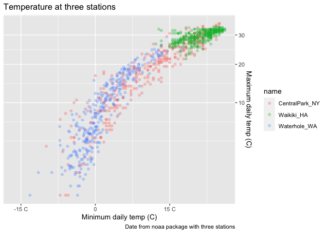
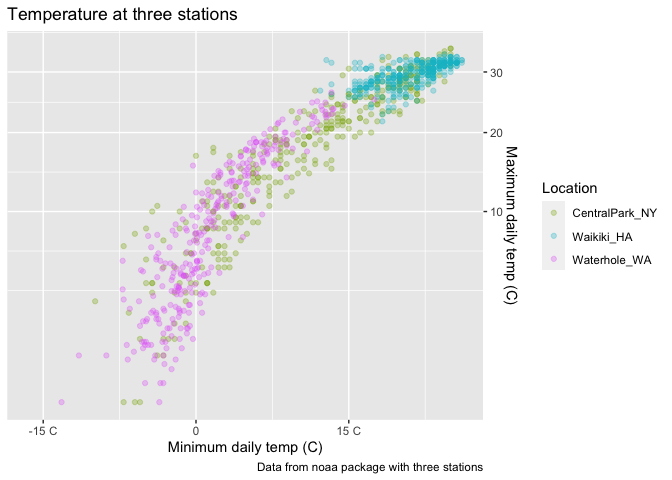
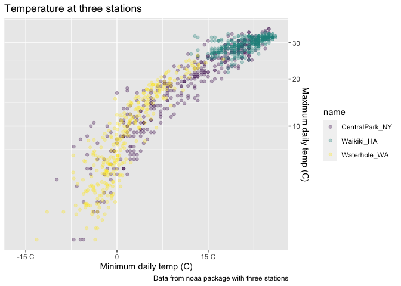
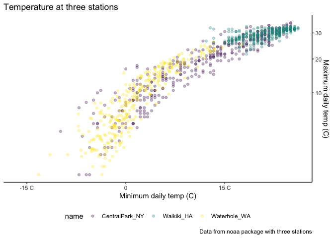
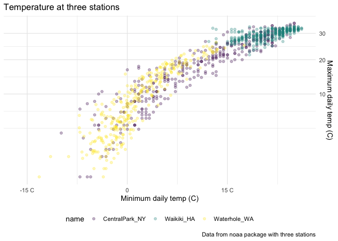
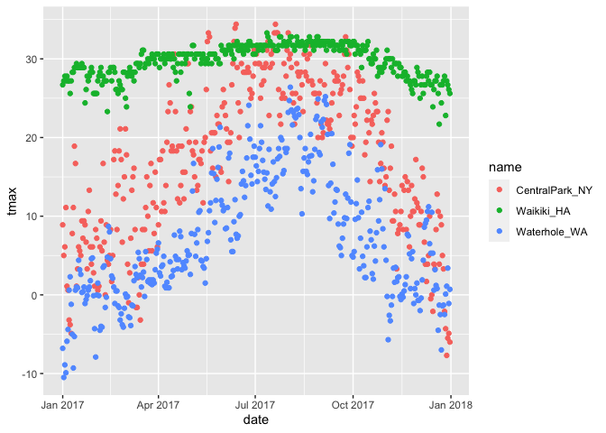
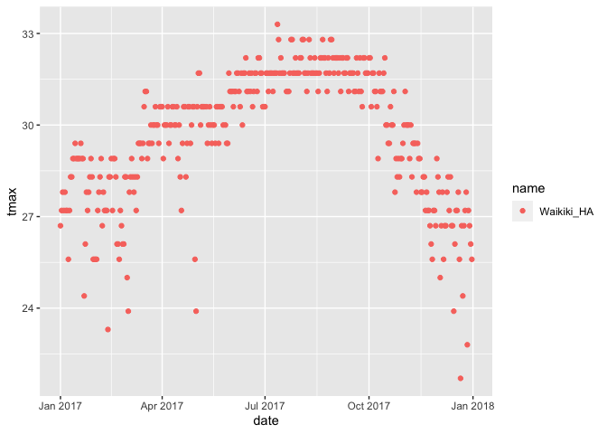

viz\_eda\_2
================
Kaila Boyer
10/7/2021

Can include code in the beginning of a document that sets the
themes/settings/color for all ggplots (look at lecture page on website
for code)

Loading in dataset

``` r
weather_df = 
  rnoaa::meteo_pull_monitors(
    c("USW00094728", "USC00519397", "USS0023B17S"),
    var = c("PRCP", "TMIN", "TMAX"), 
    date_min = "2017-01-01",
    date_max = "2017-12-31") %>%
  mutate(
    name = recode(
      id, 
      USW00094728 = "CentralPark_NY", 
      USC00519397 = "Waikiki_HA",
      USS0023B17S = "Waterhole_WA"),
    tmin = tmin / 10,
    tmax = tmax / 10) %>%
  select(name, id, everything())
```

    ## Registered S3 method overwritten by 'hoardr':
    ##   method           from
    ##   print.cache_info httr

    ## using cached file: ~/Library/Caches/R/noaa_ghcnd/USW00094728.dly

    ## date created (size, mb): 2021-03-22 17:09:07 (7.559)

    ## file min/max dates: 1869-01-01 / 2021-03-31

    ## using cached file: ~/Library/Caches/R/noaa_ghcnd/USC00519397.dly

    ## date created (size, mb): 2021-10-05 10:30:50 (1.697)

    ## file min/max dates: 1965-01-01 / 2020-02-29

    ## using cached file: ~/Library/Caches/R/noaa_ghcnd/USS0023B17S.dly

    ## date created (size, mb): 2021-10-05 10:30:53 (0.912)

    ## file min/max dates: 1999-09-01 / 2021-09-30

tmax vs. tmin

``` r
weather_df %>% 
  ggplot(aes(x = tmin, y = tmax, color = name)) + 
  geom_point(alpha = .3) + 
  labs( 
    title = "Temperature at three stations", 
    x = "Minimum daily temp (C)", 
    y = "Maximum daily temp (C)", 
    caption = "Date from noaa package with three stations")
```

    ## Warning: Removed 15 rows containing missing values (geom_point).

<!-- -->

## Scales

``` r
weather_df %>% 
  ggplot(aes(x = tmin, y = tmax, color = name)) + 
  geom_point(alpha = .3) + 
  labs( 
    title = "Temperature at three stations", 
    x = "Minimum daily temp (C)", 
    y = "Maximum daily temp (C)", 
    caption = "Date from noaa package with three stations") + 
  scale_x_continuous(
    breaks = c(-15, 0, 15), 
    labels = c("-15 C", "0", "15 C")
  ) + 
  scale_y_continuous(
    trans = "sqrt", 
    position = "right"
  )
```

    ## Warning in self$trans$transform(x): NaNs produced

    ## Warning: Transformation introduced infinite values in continuous y-axis

    ## Warning: Removed 90 rows containing missing values (geom_point).

<!-- -->

## Color Scales

``` r
weather_df %>% 
  ggplot(aes(x = tmin, y = tmax, color = name)) + 
  geom_point(alpha = .3) + 
  labs( 
    title = "Temperature at three stations", 
    x = "Minimum daily temp (C)", 
    y = "Maximum daily temp (C)", 
    caption = "Data from noaa package with three stations") + 
  scale_x_continuous(
    breaks = c(-15, 0, 15), 
    labels = c("-15 C", "0", "15 C")
  ) + 
  scale_y_continuous(
    trans = "sqrt", 
    position = "right"
  ) + 
  scale_color_hue(
    name = "Location", 
    h = c(100,300))
```

    ## Warning in self$trans$transform(x): NaNs produced

    ## Warning: Transformation introduced infinite values in continuous y-axis

    ## Warning: Removed 90 rows containing missing values (geom_point).

<!-- -->

``` r
weather_df %>% 
  ggplot(aes(x = tmin, y = tmax, color = name)) + 
  geom_point(alpha = .3) + 
  labs( 
    title = "Temperature at three stations", 
    x = "Minimum daily temp (C)", 
    y = "Maximum daily temp (C)", 
    caption = "Data from noaa package with three stations") + 
  scale_x_continuous(
    breaks = c(-15, 0, 15), 
    labels = c("-15 C", "0", "15 C")
  ) + 
  scale_y_continuous(
    trans = "sqrt", 
    position = "right"
  ) + 
  scale_color_hue(
    name = "Location") +
  scale_color_viridis_d()
```

    ## Scale for 'colour' is already present. Adding another scale for 'colour',
    ## which will replace the existing scale.

    ## Warning in self$trans$transform(x): NaNs produced

    ## Warning: Transformation introduced infinite values in continuous y-axis

    ## Warning: Removed 90 rows containing missing values (geom_point).

<!-- -->

## Themes

``` r
weather_df %>% 
  ggplot(aes(x = tmin, y = tmax, color = name)) + 
  geom_point(alpha = .3) + 
  labs( 
    title = "Temperature at three stations", 
    x = "Minimum daily temp (C)", 
    y = "Maximum daily temp (C)", 
    caption = "Data from noaa package with three stations") + 
  scale_x_continuous(
    breaks = c(-15, 0, 15), 
    labels = c("-15 C", "0", "15 C")
  ) + 
  scale_y_continuous(
    trans = "sqrt", 
    position = "right"
  ) + 
  scale_color_hue(
    name = "Location", 
    h = c(100,300)) + 
  scale_color_viridis_d() +
  theme_bw() +
  theme(legend.position = "bottom") 
```

    ## Scale for 'colour' is already present. Adding another scale for 'colour',
    ## which will replace the existing scale.

    ## Warning in self$trans$transform(x): NaNs produced

    ## Warning: Transformation introduced infinite values in continuous y-axis

    ## Warning: Removed 90 rows containing missing values (geom_point).

<!-- -->

``` r
weather_df %>% 
  ggplot(aes(x = tmin, y = tmax, color = name)) + 
  geom_point(alpha = .3) + 
  labs( 
    title = "Temperature at three stations", 
    x = "Minimum daily temp (C)", 
    y = "Maximum daily temp (C)", 
    caption = "Data from noaa package with three stations") + 
  scale_x_continuous(
    breaks = c(-15, 0, 15), 
    labels = c("-15 C", "0", "15 C")
  ) + 
  scale_y_continuous(
    trans = "sqrt", 
    position = "right"
  ) + 
  scale_color_hue(
    name = "Location", 
    h = c(100,300)) + 
  scale_color_viridis_d() +
  theme_classic() +
  theme(legend.position = "bottom") 
```

    ## Scale for 'colour' is already present. Adding another scale for 'colour',
    ## which will replace the existing scale.

    ## Warning in self$trans$transform(x): NaNs produced

    ## Warning: Transformation introduced infinite values in continuous y-axis

    ## Warning: Removed 90 rows containing missing values (geom_point).

<!-- -->

``` r
weather_df %>% 
  ggplot(aes(x = tmin, y = tmax, color = name)) + 
  geom_point(alpha = .3) + 
  labs( 
    title = "Temperature at three stations", 
    x = "Minimum daily temp (C)", 
    y = "Maximum daily temp (C)", 
    caption = "Data from noaa package with three stations" 
    ) + 
  scale_x_continuous(
    breaks = c(-15, 0, 15), 
    labels = c("-15 C", "0", "15 C")
  ) + 
  scale_y_continuous(
    trans = "sqrt", 
    position = "right"
  ) + 
  scale_color_hue(
    name = "Location", 
    h = c(100,300)) + 
  scale_color_viridis_d() +
  theme_minimal() +
  theme(legend.position = "bottom") 
```

    ## Scale for 'colour' is already present. Adding another scale for 'colour',
    ## which will replace the existing scale.

    ## Warning in self$trans$transform(x): NaNs produced

    ## Warning: Transformation introduced infinite values in continuous y-axis

    ## Warning: Removed 90 rows containing missing values (geom_point).

<!-- -->

## ‘data’ in geoms

``` r
weather_df %>% 
  ggplot(aes(x = date, y = tmax, color = name)) + 
  geom_point()
```

    ## Warning: Removed 3 rows containing missing values (geom_point).

<!-- -->

``` r
central_park <- weather_df %>% filter(name == "CentralPark_NY")

waikiki <- weather_df %>%  filter(name == "Waikiki_HA")

waikiki %>% ggplot(aes(x = date, y = tmax, color = name)) + 
  geom_point()
```

    ## Warning: Removed 3 rows containing missing values (geom_point).

<!-- -->

``` r
waikiki %>% 
  ggplot(aes(x = date, y = tmax, color = name)) + 
  geom_point() + 
  geom_line(data = central_park)
```

    ## Warning: Removed 3 rows containing missing values (geom_point).

<!-- -->
